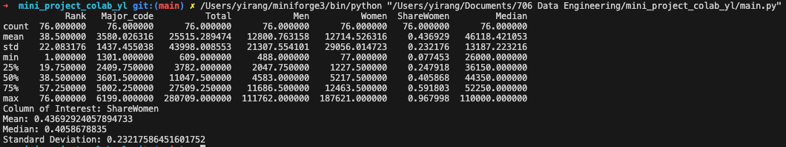
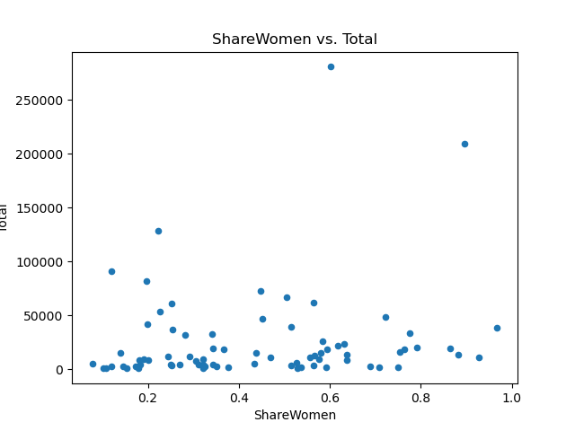

# Mini_Project_Colab_YL

## Google Collab Link
https://colab.research.google.com/drive/1WWXtg0ShwTYmFoFIAYD9chxtZAx8Wvon?usp=sharing

## Directory

Liu_Yirang_Individual_Project_1/
├── .devcontainer/
│   ├── devcontainer.json
│   └── Dockerfile
├── .github/
│   └── workflows/
│       ├── format.yml
│       ├── install.yml
│       ├── lint.yml
│       └── test.yml
├── mylib/
│   ├── __init__.py
│   └── calculator.py
├── .gitignore
├── Dockerfile
├── Histogram_of_ShareWomen.png
├── LICENSE
├── main.html
├── main.ipynb
├── main.pdf
├── main.py
├── Makefile
├── README.md
├── repeat.sh
├── requirements.txt
├── Scatter_of_ShareWomen.png
├── setup.sh
├── Stat_Summary.png
├── test_main.py
└── women-stem.csv

## Project Introduction
This project aims to set up and utilize a cloud-hosted Jupyter Notebook environment (i.e. Google Colab) to analyze a job application dataset published by the City of Los Angeles. The analysis involves data manipulation such as generating summary statistics and visualizing data to reveal trends in gender and ethnicity among job applicants. 

## Assignment Requirements
* Set up a cloud-hosted Jupyter Notebook (e.g., Google Colab)
* Perform data manipulation tasks on a sample dataset

## Grading Criteria
* Setup and configuration (20 points)
* Data manipulation tasks (20 points)
* CI/CD pipeline (10 points)
* README.md (10 points)

## Deliverables
* Link to the cloud-hosted notebook
* Document or video demonstrating the tasks performed

## Submission 
* Public repository URL

## Statistic Summary 

## Data Visualizations

